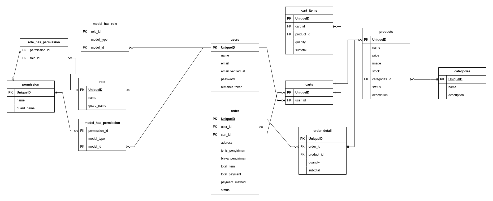

# Design modules

1. user bisa melihat list produk yang tersedia
2. User bisa melihat detail informasi item yang tersedia
3. User bisa menambahkan produk yang ingin dibeli ke keranjang
4. User bisa melakukan checkout aplikasi, dan akan masuk ke list transaksi
5. User bisa melihat detail transaksinya

# Database Design

# Monolite / Microservice

> Module yang saya pilih saat mengerjakan project ini yaitu module Monolite, mengapa saya memilih monolite jika dibandingkan dengan Microservice karena apilkasi yang akan saya buat tidak akan terlalu komplek jadi saya memutuskan untuk menggunakan monolite, kedua karena aplikasinya yang akan saya buat juga belum termasuk aplikasi yang besar jadi saya lebih ke arsitektur monolite, jika menggunakan Microservice bisa boros sumber daya dan biaya pengembangan. serta jika menggunakan microservice, kan harus nge-deploy beberapa layanan, sedangkan kalau pake Monolite, semua jadi satu saja. dan juga jika menggunakan microservice mungkin waktunya tidak akan cukup untuk saya kerjakan. kemudian dengan menggunakan monolite juga untuk aplikasi yang sederhana memudahkan kita dalam menganalisis kodenya karena tidak perlu mencari ke service dimana bugs tersebut terjadi. alasan terakhir saya tidak menggunakan microservice yaitu menghemat waktu pengembangan dan juga karena saya belum terlalu memahami cara pengaplikasian mircoresvicenya itu sendiri. tetapi untuk real casenya sendiri saya akan menggunakan micro service jika melihat skala aplikasinya yang cukup besar, namun jika hanya skala kecil menggunakan monolite sudah cekup sepertinya.

# Incomplete (WIP)

-   [ ] Add Management Toko for role seller
-   [ ] Api Documentation

# Complete

-   [x] Management User, Auth, Role, & Permission
-   [x] List Product
-   [x] Category, Detail Product
-   [x] Add To Cart
-   [x] Checkout dan List Transaksi

# Tech Stack

-   Laravel 10 (API)
-   Postgresql 15
-   Git
-   Vs Code
